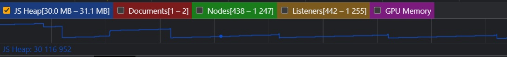
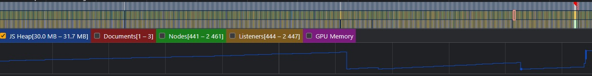
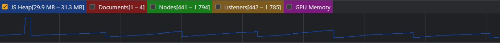
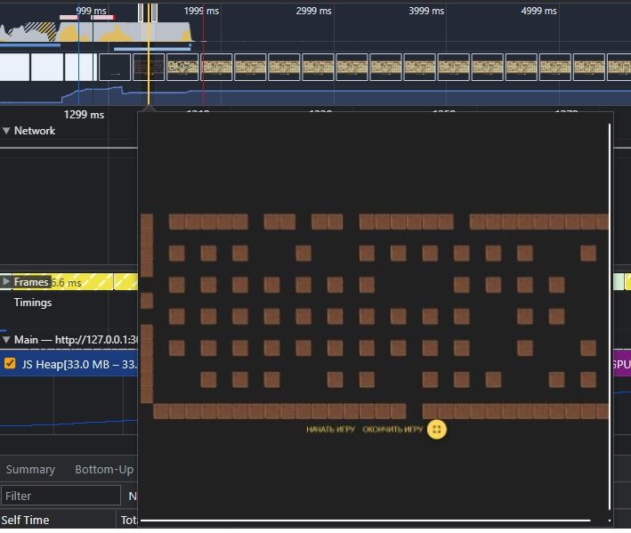
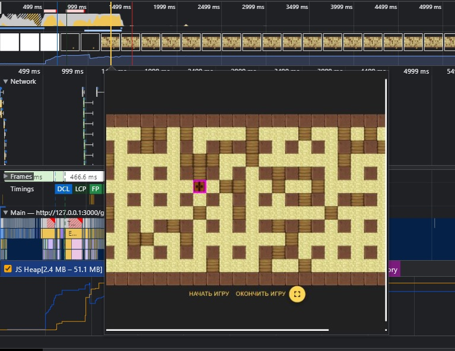

# Поиск утечек памяти

Для поиска утечек памяти использовались:

1. DevTools->Performance->Memory
2. eslint 'import/no-cycle'
3. Анализ кода

## DevTools

С помощью данного метода обнаружить утечки памяти не удалось, после работы сборщика мусора память возвращадась к
первоначальному значению

Примеры:

- Перемещение игрока по полю
- Добавлено много бомб на поле и наблюдение за множеством одновременных взрывов
- Добавлено много бомб на поле, которые разрушают кирпичные стены, наблюдение за большим количеством одновременных
  анимаций

## Циклические зависимости
Для поиска такого типа утечек памяти как `Циклические зависимости`
было добавлено правило `eslint 'import/no-cycle'`
Утечек на данный момент обнаружить не удалось, но данное правило поможет избежать 
появления циклических зависимостей в будущем.

## Анализ кода
Было проведено ревью кода с целью обнаружения утечек памяти таких типов:

1. Глобальные переменные

Было проверено что после использования глобальных объектов они удаляются (например в SSR+redux)

2. Неожиданно долгоживущие колбеки
 - Event Listeners 

Было проверено что обработчики событий, добавленные с помощью addEventListener
удаляются с помощью removeEventListener.
 - Timers&Intervals

В коде для каждого setInterval/setTimeout использовался clearInterval/clearTimeout. 
При завершении игры страница перезагружается, память очищается

В процессе поиска утечек памяти было обнаружено место для улучшения:

до 
после 

